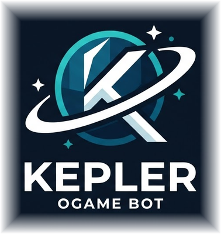
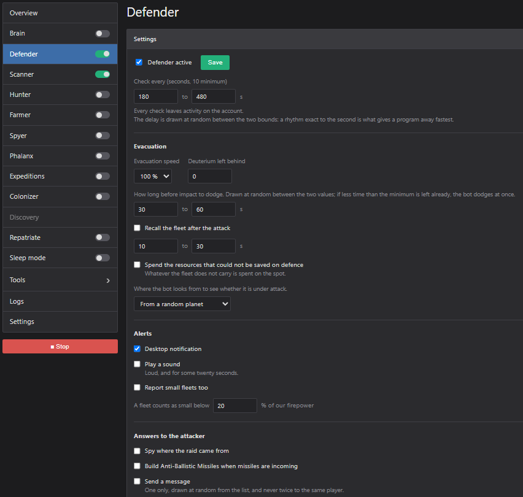
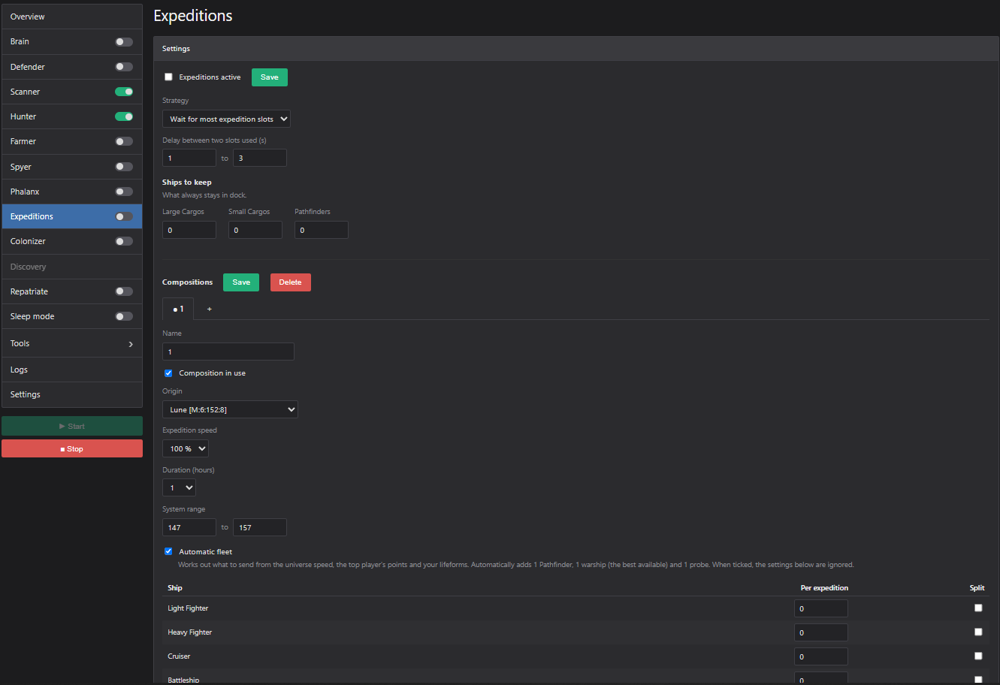
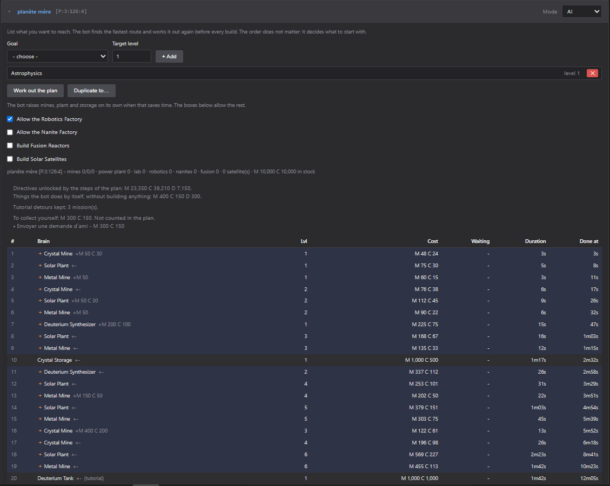
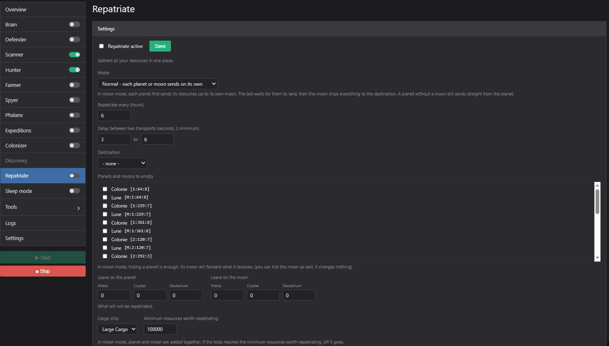
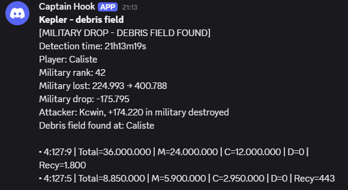
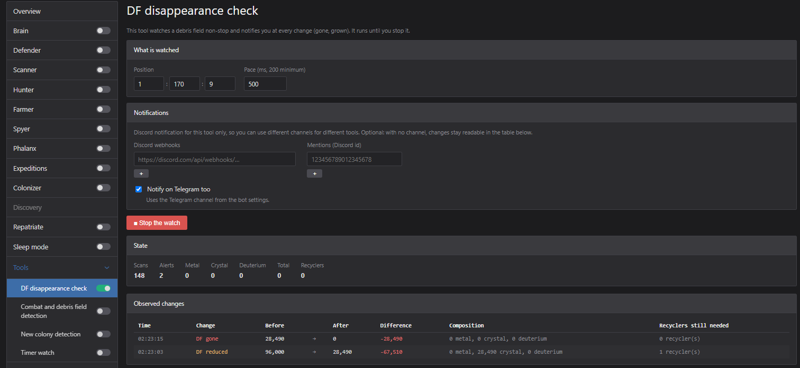
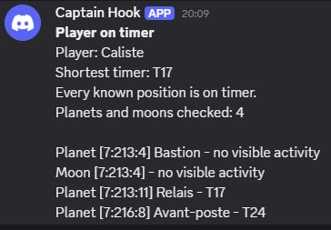
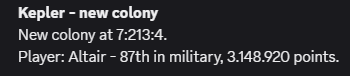

<h1 align="center">Kepler, le bot OGame</h1>

<b>Votre compte OGame, joué pour vous par un bot conçu par des joueurs de longue date.</b>

  <a href="https://keplerbot.net">Site</a> · <a href="https://keplerbot.net/telecharger">Télécharger</a> · <a href="https://keplerbot.net/prix">Prix</a> · <a href="https://keplerbot.net/fonctionnalites">Fonctionnalités</a> · <a href="https://keplerbot.net/scripts">Doc des scripts</a> · <a href="https://keplerbot.net/faq">FAQ</a>

<a href="README.md">English</a> · Français

Kepler prend en charge la partie répétitive d'OGame : mines et recherches, expéditions, pillage, rapatriement, et la mise à l'abri de votre flotte quand quelqu'un vient la chercher. Il tourne sur Windows, Linux et macOS, ou sur un serveur que nous hébergeons pour vous. Vous pouvez l'essayer gratuitement pendant 7 jours, sans carte bancaire.

## Ce que fait Kepler

### La défense

Kepler surveille chaque flotte qui vient vers vous. Avant l'impact, il met votre flotte hors de portée, range les ressources qu'elle ne peut pas emporter dans un chantier qu'il annulera ensuite, et vous prévient sur Telegram ou Discord avec l'heure d'impact. Les vagues d'une attaque groupée sont additionnées avant de décider, et une destruction de lune est toujours prise au sérieux.

### Les expéditions

Les expéditions partent toutes seules avec la configuration que vous choisissez. En début d'univers, Kepler répartit vos vaisseaux à parts égales sur les emplacements libres. Ensuite, il compose la flotte lui-même : assez de grands transporteurs pour l'avancement du serveur, plus un éclaireur, votre meilleur vaisseau de combat et une sonde. Il peut envoyer depuis plusieurs planètes à la fois.

### La construction

Donnez-lui un objectif, par exemple Astrophysique 1 sur un compte neuf, et Kepler trouve le chemin le plus rapide, prérequis compris, en faisant les missions du tutoriel au passage. Vous préférez garder la main ? Mettez en file exactement ce que vous voulez : il construit dès que les ressources sont là, niveaux précédents compris. Les formes de vie et leurs technologies font partie du plan.

### Le rapatriement

Les ressources des colonies rentrent dès qu'elles passent un seuil que vous fixez pour chacune. En mode lune, les planètes montent d'abord leurs ressources sur leur propre lune, et les transports partent de là : deux fois moins d'emplacements de flotte, et rien à voir pour une phalange.

## Les outils qui vous préviennent

**Détection de champ de débris.** À chaque combat dans votre univers, vous savez qui a frappé qui et où se trouve le champ de débris, à temps pour le voler ou pour prendre en retour les recycleurs ennemis.

**Check disparition CDR.** Gardez un œil sur un champ de débris et soyez prévenu au moindre changement.

**Surveillance timer.** Donnez à Kepler le nom de vos cibles d'espionnage : il vous dit dès que l'une d'elles devient inactive.

**Détection de nouvelle colonie.** Sachez tout de suite quand quelqu'un s'installe dans votre système, ou surveillez les colonisations autour de vous pour voir venir un rush.

## Et le reste

- **Espionnage :** des zones d'espionnage réglées une fois, relancées d'un clic chaque jour.
- **Phalange :** la seconde exacte où une flotte est rentrée, même sur une phalange encombrée après un moonbreak.
- **Planification des vols :** la cible, la mission, la flotte et l'heure d'arrivée, et le vol tombe pile dessus.
- **Scanner de galaxie :** tous les systèmes parcourus à intervalles réguliers, pour savoir où est chacun.
- **Surveillance de joueurs :** un tableau d'activité par joueur, pour repérer les trous qui reviennent.
- **Pillage :** des campagnes contre les inactifs, enregistrées et relancées d'un clic.
- **Colonisation :** il colonise jusqu'à obtenir la position, la taille ou la température demandées. Une planète dont une seule case est utilisée n'est jamais supprimée.
- **Alertes :** vous choisissez ce qui vous arrive sur Telegram ou Discord.
- **Mode veille :** des pauses à la main ou selon un planning. Ce qui tournait repart au réveil.
- **Plusieurs comptes :** autant de bots que votre licence le permet, chacun avec ses réglages et sa propre empreinte de navigateur.

Chacun a son écran et ses réglages. Le tour complet est sur la [page des fonctionnalités](https://keplerbot.net/fonctionnalites).

## La nuit

Votre flotte part pour la nuit et revient dans la plage que vous fixez, à la main ou liée au mode veille. Pendant ce temps, Kepler continue de jouer : les expéditions vont et viennent, les mines montent, les recherches avancent. Une vraie attaque vous arrive sur Discord ou Telegram ; une petite flotte sans danger ne vous réveille pas, et c'est vous qui placez la limite.

## La sécurité du compte

- **Un rythme humain.** Les requêtes sont espacées, les heures de travail suivent les vôtres, et les réveils ne tombent pas sur des chiffres ronds.
- **Son propre navigateur.** Chaque bot a son empreinte : navigateur, écran, fuseau, langues, carte graphique. Vous pouvez la modifier.
- **Sa propre adresse.** En version hébergée, chaque bot reçoit une adresse IP dédiée dans le pays de votre choix, et deux comptes n'en partagent jamais une.
- **Une pause quand vous voulez.** Un clic, ou des plages de veille pendant lesquelles il ne touche à rien.

## Chez vous, ou hébergé chez nous

**Chez vous**, c'est un seul fichier : rien à installer, et l'interface s'ouvre dans votre navigateur. Vos identifiants OGame restent chiffrés sur votre machine.

**Hébergé**, nous montons le serveur et son adresse dédiée. Il tourne jour et nuit, vous ne laissez rien ouvert, vous le pilotez de partout, et les mises à jour se font sans vous.

Commencer chez vous et passer à l'hébergé plus tard, c'est un export et un import : vos bots arrivent avec leurs réglages.

## L'essai gratuit

Sept jours, sans carte bancaire. Créez votre compte, téléchargez, ajoutez votre bot. À la fin de l'essai, les bots s'arrêtent et l'interface vous dit pourquoi, sans rien effacer : abonnez-vous, et tout est encore là.

**[Télécharger Kepler](https://keplerbot.net/telecharger)** · **[Voir les prix](https://keplerbot.net/prix)**

## Les scripts

Quand les automatismes ne suffisent pas, écrivez les vôtres : Kepler exécute des scripts `.ank`, de petits programmes qui pilotent votre compte pas à pas. Rappeler votre flotte quand un joueur précis se connecte, écrire sur Discord quand un champ de débris dépasse le million, parcourir trois galaxies et noter ce qu'on y trouve.

La [référence des scripts](https://keplerbot.net/scripts) est vérifiée contre le moteur lui-même : chaque fonction avec sa signature exacte, le nombre de valeurs qu'elle rend, son coût en requêtes et un exemple qui tourne.

- [Flottes, vols et combat](https://keplerbot.net/scripts/flottes)
- [Célestes et ressources](https://keplerbot.net/scripts/celestes)
- [Piloter les workers](https://keplerbot.net/scripts/workers)
- [Compte, galaxie, joueurs et messages](https://keplerbot.net/scripts/galaxie)
- [Ordonnancement](https://keplerbot.net/scripts/ordonnancement)
- [Toutes les fonctions, à la suite](https://keplerbot.net/scripts/fonctions)

Vous écrivez avec un assistant IA (Claude, ChatGPT, Cursor, Copilot) ? Branchez-le sur le [serveur MCP de Kepler](https://keplerbot.net/scripts/mcp) : il lit cette même référence, toujours à jour.

Dix scripts complets pour démarrer sont dans le dossier [`scripts`](scripts) (en anglais).

## FAQ

**Mon compte peut-il être banni ?**
Oui, c'est possible. Automatiser un compte est contraire aux règles d'OGame, et aucun outil ne peut exclure une sanction. Ce que fait Kepler, c'est ne pas se comporter comme un script : des requêtes espacées, des heures de travail qui suivent les vôtres, des délais qui varient, une empreinte de navigateur propre à chaque bot et, en version hébergée, une adresse IP dédiée par compte. Les réglages par défaut sont les plus sûrs : gardez un rythme humain.

**Mes identifiants OGame arrivent-ils chez vous ?**
Pas avec la version que vous faites tourner vous-même. Le bot se connecte à Gameforge directement depuis votre machine, et votre mot de passe est rangé chiffré (AES-256-GCM) dans son dossier de données. Il n'est jamais affiché ni écrit dans un journal. Kepler ne reçoit de votre bot que votre clé de licence, un identifiant de machine, la version du bot et votre offre. En version hébergée, vos identifiants sont sur nos serveurs, chiffrés de la même façon. La [page Sécurité](https://keplerbot.net/securite) donne le détail.

**Et si votre site tombe en panne ?**
Vos bots continuent de tourner. La licence se vérifie sur votre propre machine, et le bot ne nous contacte que pour la renouveler, avec plusieurs jours de marge.

**Dois-je laisser mon ordinateur allumé ?**
Pour la version que vous faites tourner vous-même, oui : le bot tourne tant que l'ordinateur tourne. La version hébergée tourne sur nos serveurs, jour et nuit.

**Puis-je faire tourner plusieurs comptes ou univers ?**
Oui : un bot par compte OGame, autant que votre licence en couvre, chacun avec ses réglages et sa propre empreinte.

**Comment tout arrêter ?**
Fermez sa console ou son terminal. Rien n'est installé, rien ne démarre avec le système, aucun service ne reste en arrière-plan.

D'autres questions sur la [page FAQ](https://keplerbot.net/faq).

## À propos de ce dépôt

Ce dépôt présente Kepler et contient des exemples de scripts. Il ne contient aucun code source du bot. Les téléchargements sont sur la [page officielle](https://keplerbot.net/telecharger), avec l'empreinte de chaque fichier.

Kepler est un outil indépendant, sans lien avec Gameforge ni approbation de sa part. Automatiser votre compte peut être contraire aux conditions d'utilisation d'OGame, et le risque est le vôtre. OGame et Gameforge sont des marques de leurs propriétaires respectifs.
